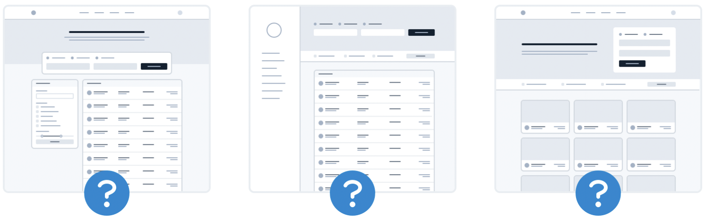
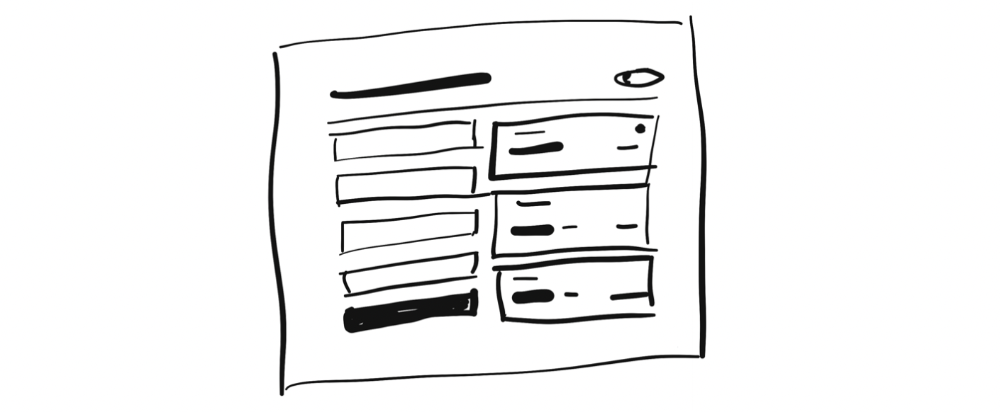

## 从特性开始，而非布局

当你开始为新的 App 创意进行设计时，你最先设计什么？如果是页面顶部的导航栏，那么你就犯了一个错误。

当开始一项新的设计时，执着于如何 **“绘制App”** ，是最容易令人沮丧和困扰的。当大多数设计师开始考虑如何“绘制App”，他们一般都在想着这个 App 的外形。

这里应该是一个顶部栏，还是一个侧边栏？

这个导航栏的元素，应该放在左边，还是放在右边？

页面内容应该放在一个容器内，还是让页面内容撑满宽度？

Logo 应该放在哪？

值得注意的是，App 实际上是大量 **特性** 的集合。在你开始设计一部分 App 特性时，你甚至都没有足够的信息支撑你的设计思路，比如一个导航栏是用来做什么的。怪不得你会感到沮丧！

与其从设计外形开始，还不如从一系列实际的功能出发。

假设，你正在为飞机订票服务构思设计，你应该从“搜索航班”这类特性开始。你的界面应当具备以下元素：

+ 显示出发城市的区域
+ 显示目的城市的区域
+ 显示出发日期的区域
+ 显示返回日期的区域
+ 一个发起搜索的按钮

从以上这些开始你的设计

天呐，你甚至可能都不需要加入其它东西了

## 设计细节放到后面考虑

在设计新功能的最初阶段，请务必不要忙于字体、阴影、图片这类低级的决定。

这类东西最终都会进入你的决策范围，但不是现在，请注意先后顺序。

当你在 Figma、Photoshop 这类高清晰平台上工作，而导致无法忽略细节时，有一个窍门就是，可以先在白纸上用粗记号笔绘制草稿。

通过手绘草稿的方式，是很难关注到小细节的，因此这会是一个非常适用于快速探索不同布局的方式。
